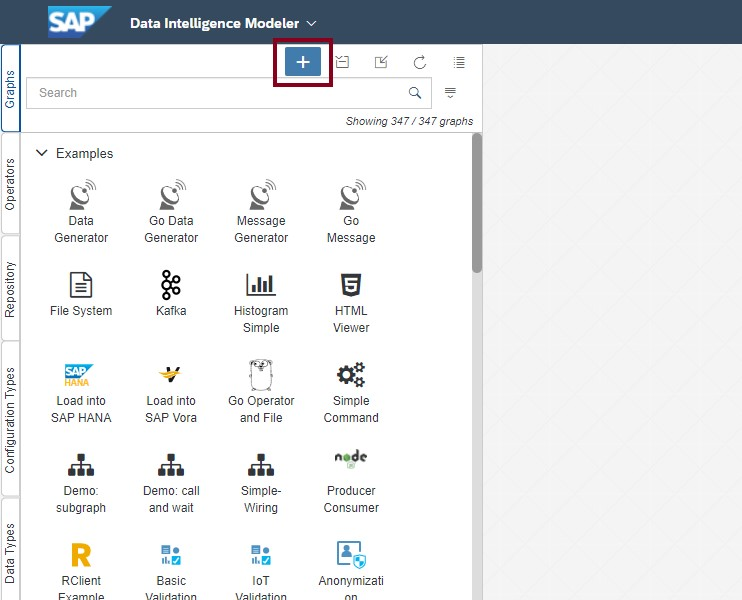
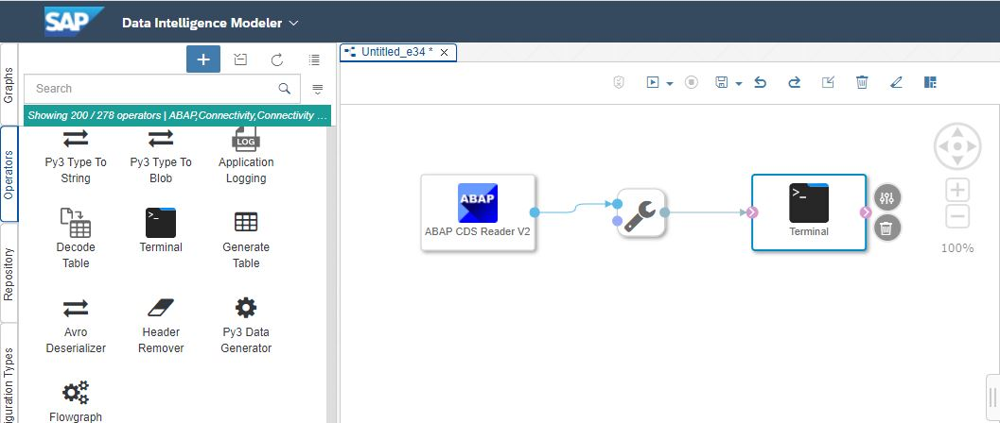
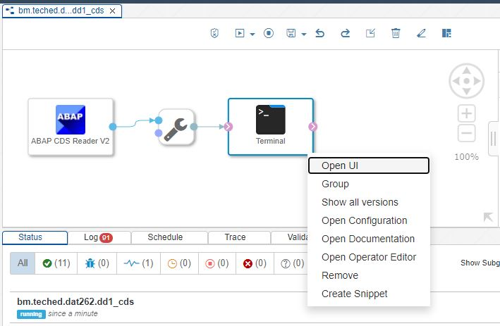
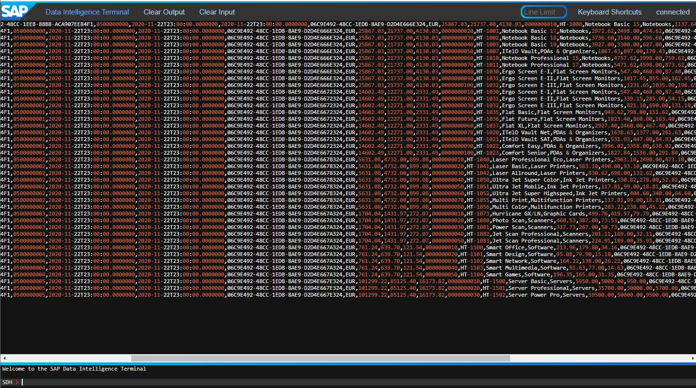
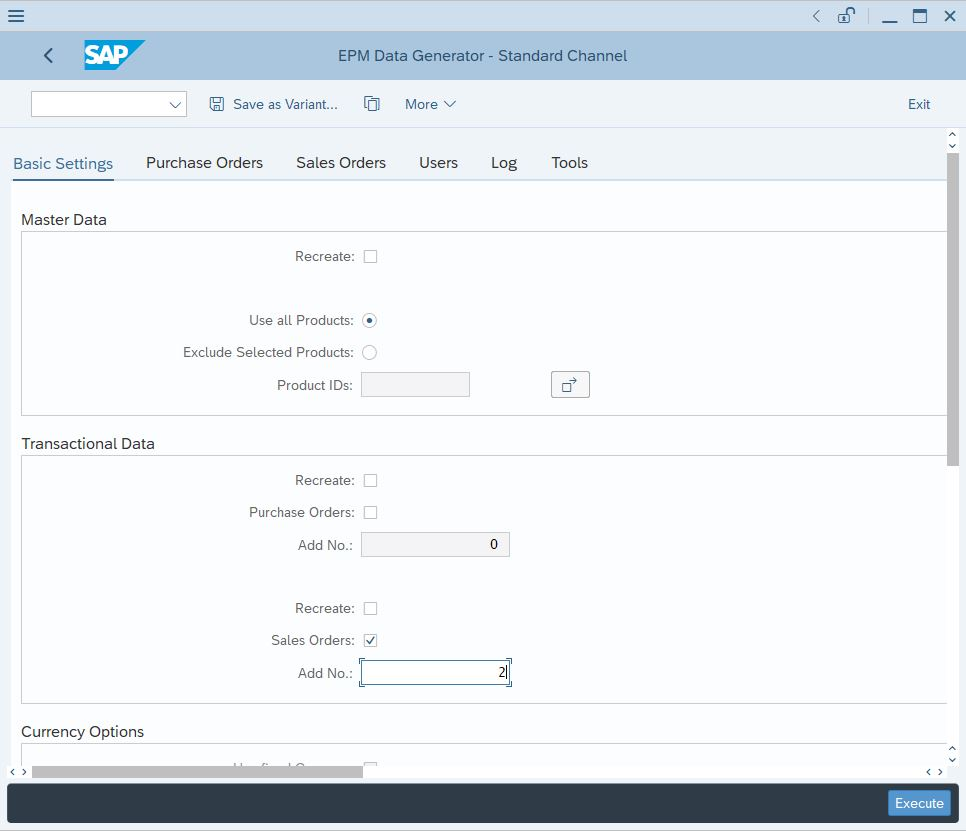

# Deep Dive 1 - ABAP CDS View based data extraction in SAP Data Intelligence

As a matter of fact, it was neither possible to make the ABAP Development Tools (ADT) available for the participants of this virtual hands-on workshop, nor was it feasible to provide a SAP GUI. For this reason, **this Deep Dive section is presented by the trainer** live in ADT and the SAP GUI connected to the underlying SAP S/4HANA system.<br>
<br>
>**IMPORTANT NOTE**<br>
>The documentation in this section is intended as a later guidance for you to reproduce the described steps in your own environments.<br>
>Even though it contains step by step instructions, **this part does not belong to the hands-on exercises!**
<br>

**ABAP Development Tools (ADT)**, formerly known as "ABAP in Eclipse", is the integrated ABAP development environment built on top of the Eclipse platform. Its main objective is to support developers in today’s increasingly complex development environments by offering state-of the art ABAP development tools. You can find more information about ADT **[here](https://tools.hana.ondemand.com/#abap)**.<br>
<br>
**CDS (Core Data Services)** is an extension of the ABAP Dictionary that allows you to define semantically rich data models in the database and to use these data models in your ABAP programs. CDS is a central part of enabling code push-down in ABAP applications.<br>
You can find more information about CDS in the **[ABAP keyword documentation](https://help.sap.com/doc/abapdocu_751_index_htm/7.51/en-US/abencds.htm)** and the **[SAP Community](https://community.sap.com/topics/abap)**.<br>
<br>
Starting with SAP S/4HANA Cloud 1905 and SAP S/4HANA 1909 FPS01 (on-premise), **Change Data Capture (CDC)** is supported for ABAP CDS Views. For a CDS view using this delta method, changes in tables belonging to this view are recorded by the Change Data Capture mechanism. From a technology perspective this delta method makes use of real-time database triggers on table level based on SLT technology. INSERT, UPDATE and DELETE operations can be recorded by the framework.<br>
- In case of an INSERT or UPDATE operation a scheduled job is selecting the records based on these key combinations from the CDS view and pushes them as complete records into the Operational Delta Queue (ODQ).
- In case of a DELETE operation the job generates an empty record with just the key field(s) filled, sets the deletion indicator and hands them over to ODQ.

Those who are interesed in more information about Change Data Capture for ABAP CDS Views may like to read the related part of the **[Data Intelligence - ABAP Integration Guide](https://help.sap.com/viewer/3a65df0ce7cd40d3a61225b7d3c86703/Cloud/en-US/55b2a17f987744cba62903e97dd99aae.html)** or the blog **[CDS based data extraction – Part II Delta Handling](https://blogs.sap.com/2019/12/16/cds-based-data-extraction-part-ii-delta-handling/)**.<br><br>

After having completed the steps in this Deep Dive section we will have created two new delta-enabled custom ABAP CDS Views on our SAP S/4HANA system. Our goal is to leverage these CDS Views later to access the Customer and Sales Order data of the Enterprise Procurement Model (our demo dataset) from Pipelines in SAP Data Intelligence.<br><br>

## Deep Dive 1.1 - Create a simple ABAP CDS View in ADT

In this sub section you can track how to create a CDS (Core Data Services) View using ABAP Development Tools (ADT). In our specific case, it is demonstrated how to create a CDS View to access data of the EPM table SNWD_BPA, which contains the Business Partner record set.

1. Create a CDS View
In the context menu of your package choose ***New*** and then choose ***Other ABAP Repository Object***.<br><br>


2.	Select ***Data Definition***, then choose ***Next***.<br><br>


3. Enter the following values, then choose Next.
- Name, e.g. ```Z_CDS_EPM_BUPA```
- Description: **CDS View for EPM Business Partner Extraction**
- Referenced Object: **SNWD_BPA**<br><br>


4.	Accept the default transport request (local) by simply choosing ***Next*** again.<br><br>


5.	Select the entry ***Define View***, then choose ***Finish***.<br><br>


6.	The new view appears in an editor, with an error showing up because of the still missing SQL View name.<br>
In this editor, enter value for the SQL View name in the annotation **`@AbapCatalog.sqlViewName`**, e.g. **`Z_SQL_EPM_BUPA`**.<br>
The SQL view name is the internal/technical name of the view which will be created in the database.<br>
**`Z_CDS_EPM_BUPA`** is the name of the CDS view which provides enhanced view-building capabilities in ABAP. 
You should always use the CDS view name in your ABAP applications.<br><br>
The data source plus its fields have automatically been added to the view definition because of the reference to the data source object we gave in step 3.
If you haven't provided that value before, you can easily search for and add your data source using the keyboard shortcut ***CTRL+SPACE***.<br><br>


7.	Delete the not needed fields in the SELECT statement, add the annotation ```@ClientHandling.type: #CLIENT_DEPENDENT``` and beautify the view.<br><br>
   <br><br>
   The code may now look as follows:
     ```abap
     @AbapCatalog.sqlViewName: 'Z_SQL_EPM_BUPA'
     @AbapCatalog.compiler.compareFilter: true
     @AbapCatalog.preserveKey: true
     @ClientHandling.type: #CLIENT_DEPENDENT
     @AccessControl.authorizationCheck: #CHECK
     @EndUserText.label: 'CDS View for EPM Business Partner Extraction'
     
     define view Z_CDS_EPM_BUPA
         as select from SNWD_BPA
         
     {
         key node_key as NodeKey,
             bp_role as BpRole,
             email_address as EmailAddress,
             phone_number as PhoneNumber,
             fax_number as FaxNumber,
             web_address as WebAddress,
             address_guid as AddressGuid,
             bp_id as BpId,
             company_name as CompanyName,
             legal_form as LegalForm,
             created_at as CreatedAt,
             changed_at as ChangedAt,
             currency_code as CurrencyCode
     }
     ```

8.	***Save (CTRL+S or disk symbol in menue bar)*** and ***Activate (CTRL+F3 or magic wand symbol in menue bar)*** the CDS View.<br>
(first  
then )<br><br>

9.	We are now able to verify the results in the ***Data Preview*** by choosing ***F8***. Our CDS View data preview should look like this:<br><br>
<br><br>

We have now successfully created the first simple CDS View in SAP S/4HANA. In the next step we'll be implementing a more complex CDS view that joins multiple tables.


## Deep Dive 1.2 - Delta-enablement for simple ABAP CDS Views

Delta-enablement for simple ABAP CDS Views is pretty easy! The only step to do is adding the `@Analytics` annotation to the view that sets the enabled flag and the change data capturing approach.<br>

Let's continue with the simple ABAP CDS View that we have implemented in the previous section and introduce the CDC delta for **`Z_CDS_EPM_BUPA`**.<br><br>

1. In ADT's Project Explorer, we navigate to our package and then to ***Core Data Services --> Data Definitions*** and double-click on the ABAP CDS View `Z_CDS_EPM_BUPA`.<br><br>
<br><br>

2. Under the existing list of annotations, enter the following lines:
   ```abap
   @Analytics:{
       dataExtraction: {
           enabled: true,
           delta.changeDataCapture.automatic: true
       }
   }
   ```
   <br><br><br>

3. ***Save*** (CTRL+S or ) and ***Activate*** (CTRL+F3 or ) the CDS View.<br><br>

In this simple case, the framework can derive the relation between the fields of the CDS view and key fields of the underlying table itself. Whenever a record is inserted, updated or deleted in the underlying table, a record with the respective table key is stored in a generated logging table. Based on this information, the scheduled job selects the data record from the CDS view and pushes it into the ODQ.<br><br>


## Deep Dive 1.3 - Create a more complex ABAP CDS View in ADT (joining multiple tables)

In this part of the Deep Dive you can learn how to create a more complex CDS View, again using the ABAP Development Tools (ADT). We will go through the implementation of a CDS View which will join the EPM tables `SNWD_SO`, `SNWD_SO_I`, `SNWD_PD`, and `SNWD_TEXTS` in order to fetch all Sales Order relevant data, including its positions, products, and product names.<br>

(As a reminder: The entity relationsships of the tables can be found [here](../ex0#short-introduction-to-the-enterprise-procurement-model-epm-in-sap-s4hana).)<br><br>

In a later step, also this CDS View will be enabled for Change Data Capturing (CDC) for an event based processing of Sales Order related deltas to the target storage.<br><br>

1. Create a CDS View
In the context menu of your package choose ***New*** and then choose ***Other ABAP Repository Object***.<br><br>


2. Select ***Data Definition***, then choose ***Next***.<br><br>


3. Enter the following values, then choose Next.
- Name, e.g. ```Z_CDS_EPM_SO```
- Description: **CDS View for EPM Sales Order object extraction**
- Referenced Object: **SNWD_SO**<br><br>


4. Accept the default transport request (local) by simply choosing ***Next*** again.<br><br>


5. Select the entry ***Define View***, then choose ***Finish***.<br><br>


6. The new view appears in an editor, with an error showing up because of the still missing SQL View name.<br>
In this editor, enter value for the SQL View name in the annotation **`@AbapCatalog.sqlViewName`**, e.g. **`Z_SQL_EPM_SO`**.<br>
The SQL view name is the internal/technical name of the view which will be created in the database. 
**`Z_CDS_EPM_SO`** is the name of the CDS view which provides enhanced view-building capabilities in ABAP. 
You should always use the CDS view name in your ABAP applications.<br><br>
The pre-defined data source plus its fields have automatically been added to the view definition because of the reference to the data source object we gave in step 3.
If you haven't provided that value before, you can easily search for and add your data source using the keyboard shortcut ***CTRL+SPACE***.<br><br>


7.	Delete the not needed fields in the SELECT statement, add the annotation ```@ClientHandling.type: #CLIENT_DEPENDENT``` and beautify the view a bit.<br><br>
<br><br>

8. For joining the EPM Sales Order Header table (`SNWD_SO`) with other related EPM tables (Sales Order Item: `SNWD_SO_I`, Product:`SNWD_PD`, Text (e.g. product names):`SNWD_TEXTS`), we can follow two different approaches.<br>
   - **JOINS**, according to classical SQL concepts and always fully executing this join condition whenever the CDS View is triggered.
     An example would be<br>```select from SNWD_SO as so left outer join SNWD_SO_I as item on so.node_key = item.parent_key```.
   - **ASSOCIATIONS**, which are a CDS View specific kind of joins. They can obtain data from the involved tables on Join conditions but the data is only fetched if required. For example, your CDS view has 4 Associations configured and user is fetching data for only 2 tables, the ASSOICATION on other 2 tables will not be triggered. This may save workload and may increase the query performance.<br> An example for a similar join condition with associations would be<br>```select from SNWD_SO as so association [0..1] to SNWD_SO_I as item	on so.node_key = item.parent_key```
   
   In our specific case, we always need to fetch data from all involved tables. Hence, we choose the classical JOIN for this example and include the following lines:<br>
   ...
   ```abap
   left outer join snwd_so_i as item on so.node_key = item.parent_key
   left outer join snwd_pd as prod on item.product_guid = prod.node_key
   left outer join snwd_texts as text on prod.name_guid = text.parent_key and text.language = 'E'
   ```
   ...<br><br>
   <br><br>

9.	Add the wanted fields from the other tables in the join condition.<br><br>
   <br><br>
   The ABAP CDS View may now look as follows:
     ```abap
     @AbapCatalog.sqlViewName: 'Z_SQL_EPM_SO'
     @AbapCatalog.compiler.compareFilter: true
     @AbapCatalog.preserveKey: true
     @ClientHandling.type: #CLIENT_DEPENDENT
     @AccessControl.authorizationCheck: #CHECK
     @EndUserText.label: 'CDS View for EPM Sales Order object extraction'
     
     define view Z_CDS_EPM_SO as select from snwd_so as so
         left outer join snwd_so_i as item on so.node_key = item.parent_key
         left outer join snwd_pd as prod on item.product_guid = prod.node_key
         left outer join snwd_texts as text on prod.name_guid = text.parent_key and text.language = 'E'
     {
         key item.node_key       as ItemGuid,
         so.node_key             as SalesOrderGuid,
         so.so_id                as SalesOrderId,
         so.created_at           as CreatedAt,
         so.changed_at           as ChangedAt,
         so.buyer_guid           as BuyerGuid,
         so.currency_code        as CurrencyCode,
         so.gross_amount         as GrossAmount,
         so.net_amount           as NetAmount,
         so.tax_amount           as TaxAmount,
         item.so_item_pos        as ItemPosition,
         prod.product_id         as ProductID,
         text.text               as ProductName,   
         prod.category           as ProductCategory,
         item.gross_amount       as ItemGrossAmount,
         item.net_amount         as ItemNetAmount,
         item.tax_amount         as ItemTaxAmount,
         prod.node_key           as ProductGuid,
         text.node_key           as TextGuid
     }
     ```

10. ***Save*** (CTRL+S or ) and ***Activate*** (CTRL+F3 or ) the CDS View.<br><br>

11. Verify the results in the ***Data Preview*** by pressing ***F8***. Our CDS View data preview should look like this:<br><br>
<br><br>


## Deep Dive 1.4 - Delta-enablement for complex ABAP CDS Views (joining multiple tables)

The main task for exposing a CDS view with CDC delta method is to provide the mapping information between the fields of a CDS view and the key fields of the underlying tables. The mapping is necessary to enable a comprehensive logging for each of the underlying tables and subsequently a consistent selection/(re-)construction of records to be provided for extraction. This means the framework needs to know which tables to log, i.e. monitor for record changes.

Given one record changes in possibly only one of the underlying tables, the framework needs to determine which record/s are affected by this change in all other underlying tables and need to provide a consistent set of delta records to the ODQ.

All key fields of the main table and all foreign key fields used by all on-conditions of the involved join(s) need to be exposed as elements in the CDS views.

The first step is to identify the tables participating in the join and its roles in the join. Currently only Left-outer-to-One joins are supported by the CDC framework. These are the common CDS views with one or more joins based on one main table. Columns from other (outer) tables are added as left outer to one join, e.g. join from an item to a header table.

Given there are no restrictions applied to the CDS view, the number of records of the CDS view constitute the number of records of the main table. All records from the main table are visible in the CDS view. Deletions of a record with regards to this CDS view only happen, if the record in the main table is deleted.

Secondly the developer needs to provide the mapping between the key fields of the underlying tables and their exposure as elements in the CDS view. Please check the following figure in which you see the representation of all underlying key fields surfacing in the CDS view.<br>

<br><br>
***Source:*** [CDS based data extraction – Part II Delta Handling](https://blogs.sap.com/2019/12/16/cds-based-data-extraction-part-ii-delta-handling/) (an excellent blog by Simon Kranig).<br><br>

In case of our EPM tables, we only need to consider one key field per table, which is the field `node_key` in all cases.
For mapping the key fields of all underlying tables to the fields of the CDS view, we use the annotation `Analytics.dataExtraction.delta.changeDataCapture.mapping`. This implies the requirement to make the key fields of all tables in the join condition elements of the ABAP CDS View.<br><br>

1. Include the following code under the list of existing annotations:
   ```abap
   @Analytics:{
       dataCategory: #FACT,
       dataExtraction: {
           enabled: true,
           delta.changeDataCapture: {
               mapping:
               [{table: 'SNWD_SO',
                 role: #MAIN,
                 viewElement: ['SalesOrderGuid'],
                 tableElement: ['node_key']
                },
                {table: 'SNWD_SO_I',
                 role: #LEFT_OUTER_TO_ONE_JOIN,
                 viewElement: ['ItemGuid'],
                 tableElement: ['node_key']
                },
                {table: 'SNWD_PD',
                 role: #LEFT_OUTER_TO_ONE_JOIN,
                 viewElement: ['ProductGuid'],
                 tableElement: ['node_key']
                },
                {table: 'SNWD_TEXTS',
                 role: #LEFT_OUTER_TO_ONE_JOIN,
                 viewElement: ['TextGuid'],
                 tableElement: ['node_key']
                }
               ]
          }
       }
   }
   ```
   <br><br>

2. ***Save*** (CTRL+S or ) and ***Activate*** (CTRL+F3 or ) the CDS View.<br><br>

3. Verify the results in the ***Data Preview*** by pressing ***F8***. The ABAP CDS View should still provide the same data as before delta-enabling.<br><br>

We have now enabled our Sales Order object CDS View for Change Data Capture and are able to obtain any delta from one of the involved tables.<br>

In the next session, we test the Initial Load and Delta Load capabilities with a small, exemplary Data Intelligence Pipeline implementation.


## Deep Dive 1.5 - Integrate ABAP CDS Views in SAP Data Intelligence Pipelines

For the integration of ABAP CDS Views in S/4HANA, SAP Data Intelligence provides standard ABAP operator shells that can easily be configured according to your use cases.
In principal, you can leverage the following approach:

1.	Logon to SAP Data Intelligence to access the Launchpad application and click on the ***Modeler*** tile.<br><br>
<br><br>

2.	In the DI Modeler, make sure the ***Graphs*** tab is in scope of the Modeler UI (see left side) and click the ***+*** symbol in order to create a new Pipeline.<br><br>
<br><br>

3.	A new Pipeline canvas opens and the design focus automatically changes to the ***Operators*** tab (see left side). Drag the ***ABAP CDS Reader*** icon from the Operator list and drop it onto the canvas. Then do one click on the ***ABAP CDS Reader*** node in the canvas and open the configuration panel by clicking on the related symbol.<br><br>
<br><br>

4.	In the configuration panel of the ***ABAP CDS Reader***, enter the following parameters:
   - ABAP Connection: **`S4_RFC_TechEd`**
   - Version: select ABAP CDS Reader V2 or enter **`com.sap.abap.cds.reader.v2`**
   - Subscription Type: **`NEW`**
   - Subscription Name: e.g. **`TechEd_SoExtractCDS001`**
   - ABAP CDS Name: **`Z_CDS_EPM_SO`** (the name that we have given to the CDS View in ADT)
   - Transfer Mode: **`Replication`** (we want to run the Initial Load and then automatically going into delta mode)
   - Records per roundtrip: leave as-is<br><br>
   <br><br>

5.	Drag the ***Terminal*** operator icon from the Operator list and drop it onto the canvas. Then connect the ***output port of the ABA CDS Reader operator*** with the ***input port of the Terminal operator***. When prompted to choose a converter from message to string data type, choose the first option (only message body gets forwarded).<br><br>
<br><br>

6.	***Save*** and ***Run*** the Pipeline. When the Pipeline status has changed from *pending* to *running*, open the Terminal UI (right mouse click on the Terminal node in the canvas.<br><br>
<br><br>

7.	In the Terminal UI, we can now see the EPM Sales Order data of the Initial Load, according to our join condition that we have specified in the ABAP CDS View.<br><br>
<br><br>

8.	In order to verify if the delta-enablement in the ABAP CDS View was successful, we create some Sales Order objects in S/4HANA using the transaction **`SEPM_DG`**. We expect that there will be new entries in the Pipeline Terminal UI in SAP Data Intelligence as well.<br><br>
<br><br>

8.	Success! In the Terminal UI in SAP Data Intelligence, the new batch of records has instantly arrived. The new records are flagged with "U", hence are updates.<br><br>
<br><br>


## Summary

We will leverage the ABAP CDS Views in the following Exercises for a more comprehensive use case.<br>
But before we do so, we still should take a closer look at SAP Data Intelligence's capabilities with regard to the integration of Function Module calls to S/4HANA.<br>
We now continue to [Deep Dive 2 - Calling an ABAP function module in SAP S/4HANA from SAP Data Intelligence](../dd2/README.md)


