# Deep Dive 2 - Calling an ABAP function module in SAP S/4HANA from SAP Data Intelligence

As a matter of fact, it was neither possible to make the ABAP Development Tools (ADT) available for the participants of this virtual hands-on workshop, nor was it feasible to provide a SAP GUI. For this reason, **this Deep Dive section is presented by the trainer** live in ADT and the SAP GUI connected to the underlying SAP S/4HANA system.<br>
<br>
>**IMPORTANT NOTE**<br>
>The following **Deep Dive 2 documentation** is intended as a later guidance for you to reproduce the described steps in your own environments.
>Even though it contains step by step instructions, **this part does not belong to the hands-on exercises!**
<br>

In this section we will demonstrate how to create a custom ABAP operator in SAP S/4HANA and trigger its execution from a Pipeline in SAP Data Intelligence. The ABAP operators are developed in the S/4HANA system as normal development objects, hence, they can be transported within the system landscape.<br>

The basis for the integration with SAP Data Intelligence are the ABAP Pipeline Engine in SAP S/4HANA and the ABAP Subengine in SAP Data Intelligence, both linked with either an RFC or a Websocket RFC connection.

After a new ABAP Operator has been created, it can immediately be used in the SAP Data Intelligence Modeler by leveraging its dynamic ABAP Integration operator. These operators in SAP Data Intelligence are actually shells that point to the original implementation in the connected S/4HANA system.

There are two variants of this operator type available in Data Intelligence:
1. SAP ABAP Operator: This can be used with any ABAP operator delivered by SAP (in namespace `com.sap`). Examples for out-of-the-box operators are (the already known) ABAP CDS Reader, ODP Reader, SLT Connector, Cluster Table Splitter (for Business Suite systems), and the ABAP Converter. 
2. Custom ABAP Operator: This can be used with any ABAP operator created by customers (in namespace `customer.<xyz>`).<br><br>


In order to use the ABAP Subengine, the following prerequisites have to be met:
1. A supported ABAP system is available (see table below)
2. The ABAP system can be reached via RFC or WebSocket RFC (HTTPS is still supported but will get deprecated soon)
3. A user with the necessary authorizations (see SAP Note [2855052](https://launchpad.support.sap.com/#/notes/2855052))
4. An RFC or Websocket RFC connection has been created in the Connection Manager
5. Whitelisting of operators and data objects (tables, views, etc.) in the S/4HANA system (see SAP Note [2831756](https://launchpad.support.sap.com/#/notes/2831756)).<br>

The ABAP Pipeline Engine is supported starting from the following releases (you can also run this scenario with a SAP Business Suite system, but then it is required to install the (non-modifying) DMIS add-on on that system.)<br>
ABAP Edition | Minimum version | Recommended Version
------------ | --------------- | -------------------
S/4HANA on Premise | OP1909 + Note 2873666 |
S/4HANA Cloud | CE2002 | 
Netweaver < 7.52 (ECC, BW, SRM, ...) | Add-On DMIS 2011 SP17 + Note 2857333 or 2857334 | Add-On DMIS 2011 SP19
Netweaver >= 7.52 (ECC, BW, SRM, ...) | Add-On DMIS 2018 SP02 + Note 2845347 | Add-On DMIS 2018 SP04
> **Note:**
> Please always also consult the most up-to-date Availability Matrix.

<br>ABAP Operators are created in the ABAP System by implementing the BAdI: `BADI_DHAPE_ENGINE_OPERATOR`.<br>
The BAdI implementation consists of a class with **two methods** that must be redefined. It is recommended that the BAdI implementation extends the abstract class
`cl_dhape_graph_oper_abstract`.
- GET_INFO: Returns metadata about the operator
- NEW_PROCESS (with its local class `lcl_process`): Creates a new instance of the operator.

`lcl_process` uses a simple event-based model and can be implemented by redefining one or more of the following methods:
- ON_START: Called once, before the graph is started
- ON_RESUME: Called at least once, before the graph is started or resumed
- STEP: Called frequently (loop)
- ON_SUSPEND: Called at least once, after the graph is stopped or suspended
- ON_STOP: Called once, after the graph is stopped

## Deep Dive 2.1 - Create a custom ABAP Operator in SAP S/4HANA

Like the CDS Views, custom ABAP Operators could also be manually implemented in S/4HANA (Class Builder) or in the ABAP Development Tools (ADT) on Eclipse.<br>
However, in order to reduce manual activities to a minimum, there is a framework available that supports you in the creation of all artifacts in the S/4HANA ABAP backend that are required for your own ABAP operator. That framework consists of two reports that must be executed in sequence:
- `DHAPE_CREATE_OPERATOR_CLASS`: Generate an implementation class
- `DHAPE_CREATE_OPER_BADI_IMPL`: Create and configure a BAdI implementation

After running these two reports, the generated implementation class can be adapted as needed.<br>
Here is a step-by-step guideline for creating a custom ABAP Operator. In the specific use case below, the ABAP Operator in S/4HANA should receive a string from a Pipeline ABAP Operator in Data Intelligence, reverses the string, and sends it back to the Pipeline ABAP Operator in Data Intelligence.

1. Logon to the SAP GUI of your conneted S/4HANA system and run transaction `SE38` (ABAP Editor), enter `DHAPE_CREATE_OPERATOR_CLASS` and ***Execute*** ( or ***F8***) this report.<br><br>
<br>

2. Enter the required parameters and ***Execute***.<br><br>
<br>

3. Now assign a package or choose 'Local Object', then ***Save*** ().<br><br>
<br>

4. You should now see the following screen. Close that windows by clicking ***Exit*** (or ***Shift+F3***).<br><br>
<br>

5. Go back to transaction `SE38` (ABAP Editor). This time, enter `DHAPE_CREATE_OPER_BADI_IMPL` and ***Execute*** ( or ***F8***) this report.<br><br>
<br>

6. Enter the required parameters and ***Execute***.<br><br>
<br>

7. Now assign a package or choose 'Local Object', then ***Save*** ().<br><br>
<br>

8. On the next screen (Enhancement Implementation), click on ***Implementing Class*** on the left side, then double click on the name of your Implementing Class, in this case `ZCL_DHAPE_OPER_REVERSE_STR`.<br><br>
<br>

9. This opens the Class Builder (`SE24`). Double click on the `GET_INFO` method in oder to assign the input and output ports of the ABAP Operator. Parameters are not needed in our use case.<br><br>
<br>

10. In the method `GET_INFO`, outcomment the three lines which specify the parameters (parameters are not needed in this scenario). The rest can be left as is. Click the ***Save*** button.<br><br>
<br>

11. Go back and double click on the `NEW_PROCESS` method in order to implement the wanted functionality for our ABAP Operator.<br><br>
<br>

12. On the next screen, double click on the local class `lcl_process`.<br><br>
<br>

13. As we are going to implement a new method `on_data`, we have to declare the method in the class definition.<br>
Add the following code snippet:<br>
```abap
  PRIVATE SECTION.
  METHODS: on_data.
```
<br>

14. We can outcomment the parameter value retrieval (see line 30 in screenshot below).<br>
Then overwrite the existing `step( )` method with the following code:<br>
```abap
  METHOD if_dhape_graph_process~step.
    rv_progress = abap_false.
    CHECK mv_alive = abap_true.

    IF mo_out->is_connected( ) = abap_false.
      IF mo_in->is_connected( ).
        mo_in->disconnect( ).
      ENDIF.
      rv_progress = abap_true.
      mv_alive = abap_false.
    ELSE.
      IF mo_in->has_data( ).
        CHECK mo_out->is_blocked( ) <> abap_true.
        rv_progress = abap_true.
        on_data( ).
      ELSEIF mo_in->is_closed( ).
        mo_out->close( ).
        rv_progress = abap_true.
        mv_alive = abap_false.
      ELSEIF mo_in->is_connected( ) = abap_false.
        mo_out->disconnect( ).
        rv_progress = abap_true.
        mv_alive = abap_false.
      ENDIF.
    ENDIF.
  ENDMETHOD.
```
<br> If `has_data( )` returns true, i.e. if the ABAP Operator receives a signal from the corresponding Data Intelligence Pipeline operator, we call the `on_data( )` method, which contains the wanted functionality (reverse an incoming string and send it back). Include the following lines after the `step( )` method:
```abap
  METHOD on_data.
    DATA lv_data TYPE string.
    mo_in->read_copy( IMPORTING ea_data = lv_data ).

    lv_data = reverse( lv_data ).

    mo_out->write_copy( lv_data ).
  ENDMETHOD.
```
<br> Now click the ***Save*** button.<br><br>
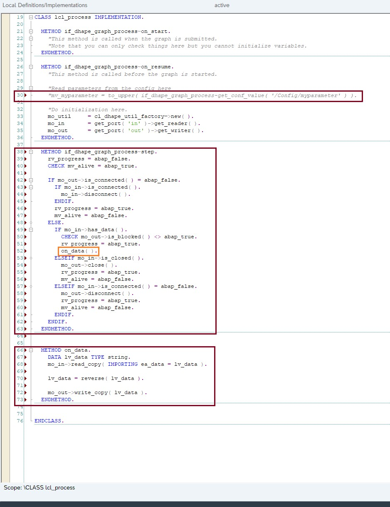<br><br>

The complete code of the local class `lcl_process` should now look as follows:

```abap
CLASS lcl_process DEFINITION INHERITING FROM cl_dhape_graph_proc_abstract.

  PUBLIC SECTION.
    METHODS: if_dhape_graph_process~on_start  REDEFINITION.
    METHODS: if_dhape_graph_process~on_resume REDEFINITION.
    METHODS: if_dhape_graph_process~step      REDEFINITION.

  PRIVATE SECTION.
  METHODS: on_data.

    DATA:
      mo_util         TYPE REF TO cl_dhape_util_factory,
      mo_in           TYPE REF TO if_dhape_graph_channel_reader,
      mo_out          TYPE REF TO if_dhape_graph_channel_writer,
      mv_myparameter  TYPE string.

ENDCLASS.

CLASS lcl_process IMPLEMENTATION.

  METHOD if_dhape_graph_process~on_start.
    "This method is called when the graph is submitted.
    "Note that you can only check things here but you cannot initialize variables.
  ENDMETHOD.

  METHOD if_dhape_graph_process~on_resume.
    "This method is called before the graph is started.

    "Read parameters from the config here
    "mv_myparameter = to_upper( if_dhape_graph_process~get_conf_value( '/Config/myparameter' ) ).

    "Do initialization here.
    mo_util     = cl_dhape_util_factory=>new( ).
    mo_in       = get_port( 'in' )->get_reader( ).
    mo_out      = get_port( 'out' )->get_writer( ).
  ENDMETHOD.

  METHOD if_dhape_graph_process~step.
    rv_progress = abap_false.
    CHECK mv_alive = abap_true.

    IF mo_out->is_connected( ) = abap_false.
      IF mo_in->is_connected( ).
        mo_in->disconnect( ).
      ENDIF.
      rv_progress = abap_true.
      mv_alive = abap_false.
    ELSE.
      IF mo_in->has_data( ).
        CHECK mo_out->is_blocked( ) <> abap_true.
        rv_progress = abap_true.
        on_data( ).
      ELSEIF mo_in->is_closed( ).
        mo_out->close( ).
        rv_progress = abap_true.
        mv_alive = abap_false.
      ELSEIF mo_in->is_connected( ) = abap_false.
        mo_out->disconnect( ).
        rv_progress = abap_true.
        mv_alive = abap_false.
      ENDIF.
    ENDIF.
  ENDMETHOD.

  METHOD on_data.
    DATA lv_data TYPE string.
    mo_in->read_copy( IMPORTING ea_data = lv_data ).

    lv_data = reverse( lv_data ).

    mo_out->write_copy( lv_data ).
  ENDMETHOD.

ENDCLASS.
```
<br>***Save*** the local class and activate () your ABAP Operator implementations.<br><br>

15. When you clicked the Activation button, you are prompted for a selection of objects. Check both and confirm ().<br><br>
<br><br>

The ABAP Operator implementation is now finished. The operator can immediately be used in SAP Data Intelligence Pipeline. The next section of this Deep Dive demo describes how this is done.<br><br>

## Deep Dive 2.2 - Integrate the custom ABAP Operator in a SAP Data Intelligence Pipeline

SAP Data Intelligence provides multiple Operator shells for the integration with ABAP Operators in SAP S/4HANA. On the one hand, there are the Operator shells that point to pre-defined ABAP Operators in ABAP systems, such as ABAP CDS Reader, ODP Reader, SLT Connector, Cluster Table Splitter (for Business Suite systems), or the ABAP Converter. On the other hand, you can also trigger custom ABAP Operators by using the "Custom ABAP Operator" shell.<br>
Technically, the approaches for calling function modules in S/4HANA are the same in both cases. The only difference is the namespace under which these ABAP Operators are maintained and selected. While the pre-built Operators belong to the namespace `com.sap.`, custom ABAP Operators are assigned to `customer`.

The integration of ABAP Operators is done via Pipelines in the SAP Data Inteligence Modeler.

1.	Logon to SAP Data Intelligence to access the Launchpad application and click on the ***Modeler*** tile.<br><br>
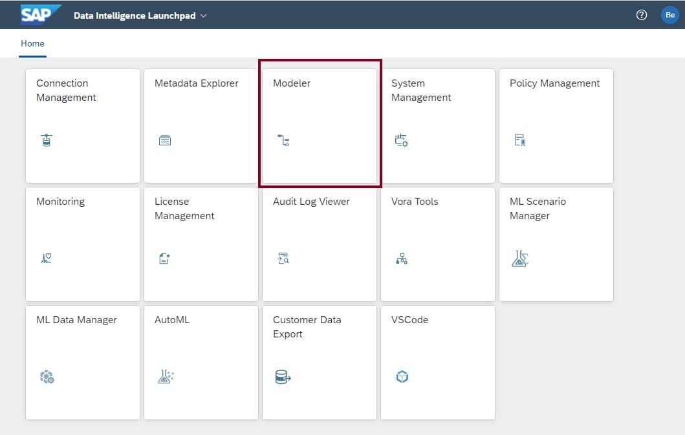<br><br>

2.	In the DI Modeler, make sure you are in the ***Graphs*** tab (see left side) and click the ***+*** symbol in order to create a new Pipeline.<br><br>
<br><br>

3.	A new Pipeline canvas opens and the design focus automatically changes to the ***Operators*** tab (see left side). Drag the ***Custom ABAP Operator*** icon from the Operator list and drop it onto the canvas. Then do one click on the ***Custom ABAP Operator*** node in the canvas and open the configuration panel by clicking on the related symbol.<br><br>
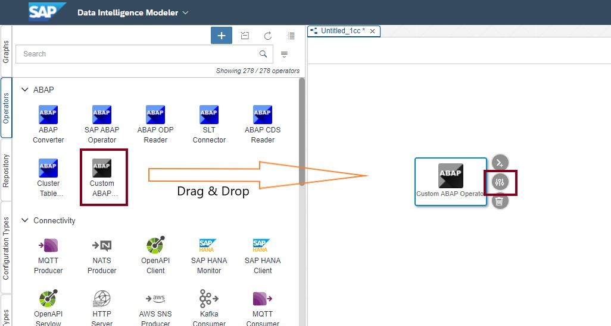<br><br>

4.	In the configuration panel on the right side, select the ***ABAP Connection*** (RFC or Websocket RFC connection) to the SAP S/4HANA system that provides the ABAP Operator. If done, click on the selection button of the field for the ***ABAP Operator***.<br><br>
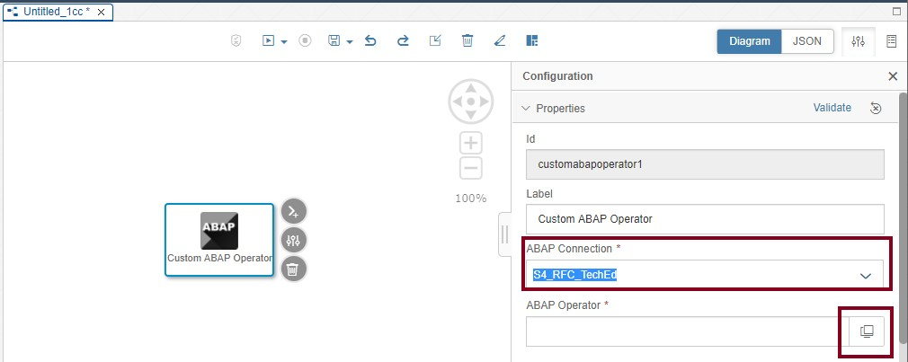<br><br>

5.	From the pop-up window, select the custom ABAP Operator that you want to call from the Pipeline. In our case, it's the ABAP Operator that receives a string, reverses it, and sends it back to the client. Hence, choose ***Operator Class: String Reversion*** and click ***OK***<br><br>
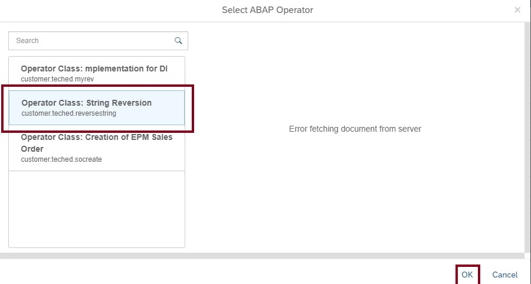<br><br>

6.	As you can see, the ABAP Operator node in the Pipeline canvas gets automatically updated with the operator's name in S/4HANA and the ports that we have defined in the previous section of this Deep Dive demo. (The `GET_INFO( )`method in our operator's ABAP class provides the corresponding meta information.)<br><br>
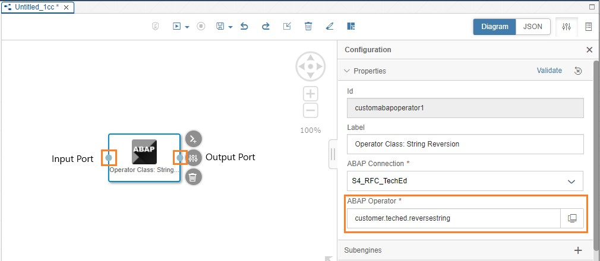<br><br>

7.	For verifying the functionality of the ABAP Operator call, we'll be using a ***Terminal*** Operator in the Pipeline. This operator allows the sending of user inputs and the reception of the results. Drag the ***Terminal*** icon from the Operator list and drop it onto the Pipeline canvas. Then connect<br>
- the output port of the ABAP Operator with the input port of the Terminal Operator and
- the output port of the Terminal Operator with the input port of the ABAP Operator.
Then ***Save*** the Pipeline.<br><br>
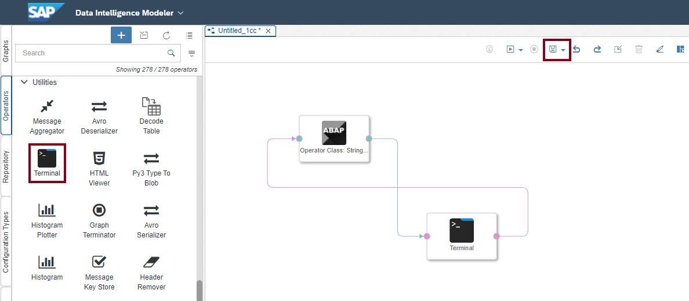<br><br>

8.	For saving the Pipeline, you are prompted for the name of the pipeline (including namespace information), a description, and the category under which the Pipeline can be found in the ***Graphs*** tab of the Modeler. Fill in the needed and click ***OK***.<br><br>
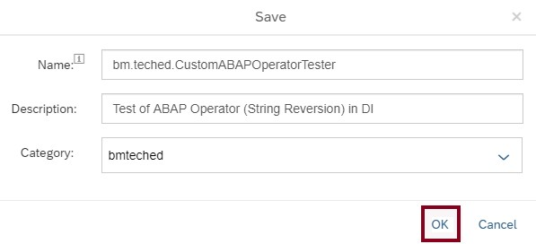<br><br>

9.	The Pipeline now gets validated by SAP Data Intelligence. You can see the results in the ***Validation*** tab of the status section in the Modeler UI. If okay, you can now start the Pipeline by clicking on the ***Play*** symbol in the menue bar.<br><br>
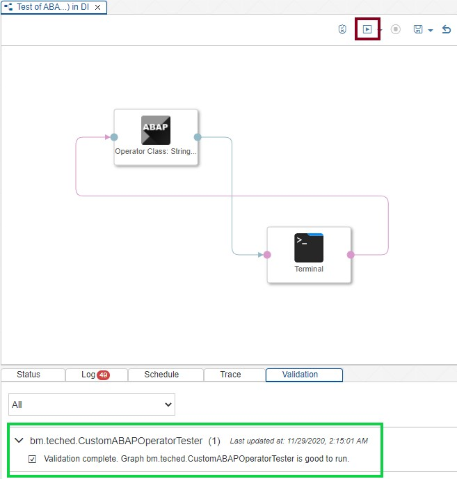<br><br>

10.	Change back to the ***Status*** tab of the status section in the Modeler UI. Once the status has turned to ***running***, click one time on the ***Terminal*** node and open the Terminal UI with a click on the corresponding icon.<br><br>
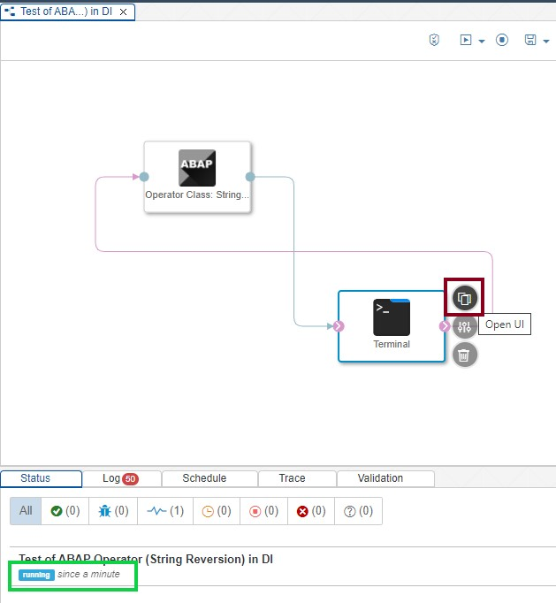<br><br>

11.	In the lower section of the Terminal UI, you can now enter the inputs (after the SDH prompt) that shall be send to the ABAP Operator in S/4HANA. After each input press ***Return***. As a resonse from our custom ABAP Operator, you should now receive the reversed strings in the upper section of the Terminal UI, what proves the functionality and integration success.<br><br>
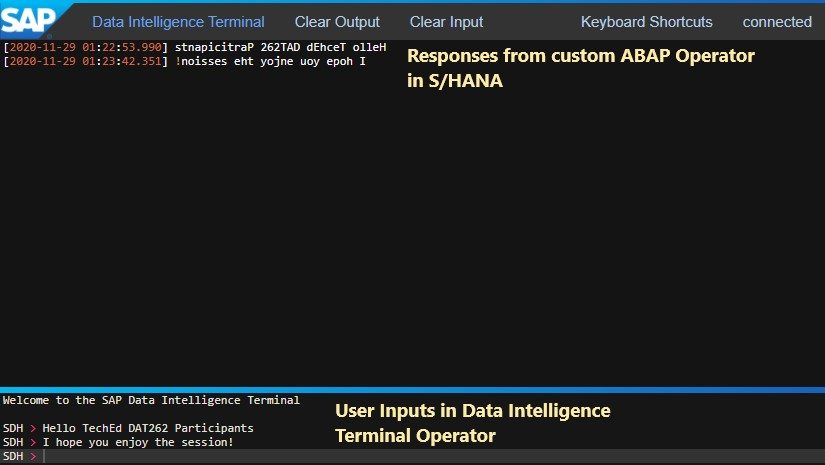<br><br>

11.	Don't forget to stop the Pipeline again if you haven't embedded a ***Graph Terminator*** before.<br><br>
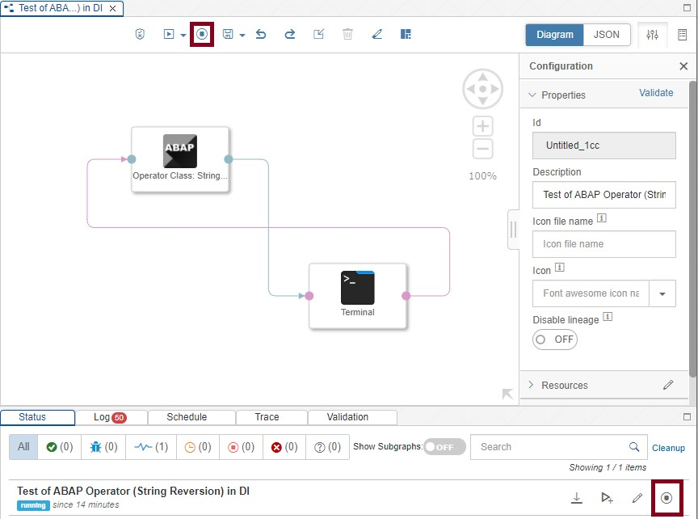<br><br>

## Summary

We've now successfully implemented a custom ABAP Operator in S/4HANA and consumed it from a Data Intelligence Pipeline.

Please continue to - [Exercise 1 - Replicating data from ABAP CDS Views in SAP Data Intelligence](../ex1/README.md)

<br><br>

*****************************************************

<br> **Table of Contents / Navigation**

- **[Overview and Getting Started](https://github.com/SAP-samples/teched2020-DAT262/tree/main/exercises/ex0#overview-and-getting-started)**
     - [Deep Dive demos vs. Exercises](https://github.com/SAP-samples/teched2020-DAT262/tree/main/exercises/ex0#deep-dive-vs-exercise-sections-in-this-document)
     - [Short introduction to the Enterprise Procurement Model (EPM) in ABAP systems](https://github.com/SAP-samples/teched2020-DAT262/tree/main/exercises/ex0#short-introduction-to-the-enterprise-procurement-model-epm-in-sap-s4hana)
     - [Access to the exercises' Data Intelligence environment](https://github.com/SAP-samples/teched2020-DAT262/tree/main/exercises/ex0#access-to-the-exercises-data-intelligence-environment)

- **[Deep Dive 1 - ABAP CDS View based data extraction in SAP Data Intelligence](https://github.com/SAP-samples/teched2020-DAT262/tree/main/exercises/dd1/)**
    - [Deep Dive 1.1 - Create a simple ABAP CDS View in ABAP Develoment Tools (ADT)](https://github.com/SAP-samples/teched2020-DAT262/tree/main/exercises/dd1#deep-dive-11---create-a-simple-abap-cds-view-in-adt)
    - [Deep Dive 1.2 - Delta-enablement for simple ABAP CDS Views](https://github.com/SAP-samples/teched2020-DAT262/tree/main/exercises/dd1#deep-dive-12---delta-enablement-for-simple-abap-cds-views)
    - [Deep Dive 1.3 - Create a more complex ABAP CDS View in ADT (joining multiple tables)](https://github.com/SAP-samples/teched2020-DAT262/tree/main/exercises/dd1#deep-dive-13---create-a-more-complex-abap-cds-view-in-adt-joining-multiple-tables)
    - [Deep Dive 1.4 - Delta-enablement for complex ABAP CDS Views (joining multiple tables)](https://github.com/SAP-samples/teched2020-DAT262/tree/main/exercises/dd1#deep-dive-14---delta-enablement-for-complex-abap-cds-views-joining-multiple-tables)
    - [Deep Dive 1.5 - Integrate ABAP CDS Views in SAP Data Intelligence Pipelines](https://github.com/SAP-samples/teched2020-DAT262/tree/main/exercises/dd1#deep-dive-15---integrate-abap-cds-views-in-sap-data-intelligence-pipelines)
    
- **[Deep Dive 2 - Calling an ABAP function module in SAP S/4HANA from SAP Data Intelligence](https://github.com/SAP-samples/teched2020-DAT262/tree/main/exercises/dd2/)**
    - [Deep Dive 2.1 - Create a custom ABAP Operator in SAP S/4HANA](https://github.com/SAP-samples/teched2020-DAT262/tree/main/exercises/dd2#deep-dive-21---create-a-custom-abap-operator-in-sap-s4hana)
    - [Deep Dive 2.2 - Integrate the custom ABAP Operator in a SAP Data Intelligence Pipeline](https://github.com/SAP-samples/teched2020-DAT262/tree/main/exercises/dd2#deep-dive-22---integrate-the-custom-abap-operator-in-a-sap-data-intelligence-pipeline)
    
- **[Exercise 1 - Replicating data from S/4HANA ABAP CDS Views in SAP Data Intelligence](https://github.com/SAP-samples/teched2020-DAT262/tree/main/exercises/ex1/)**
    - [Exercise 1.1 - Consume the EPM Business Partner ABAP CDS Views in SAP Data Intelligence](https://github.com/SAP-samples/teched2020-DAT262/tree/main/exercises/ex1#exercise-11---consume-the-epm-business-partner-abap-cds-views-in-sap-data-intelligence)
    - [Exercise 1.2 - Extend the Pipeline to transfer Customer data to an S3 Object Store (Initial Load and Delta Load)](https://github.com/SAP-samples/teched2020-DAT262/tree/main/exercises/ex1#exercise-12---extend-the-pipeline-to-transfer-the-customer-data-into-an-s3-object-store-with-initial-load-and-delta-load-modes)
    - [Exercise 1.3 - Implement a Pipeline for replication of enhanced EPM Sales Order data to an S3 Object Store](https://github.com/SAP-samples/teched2020-DAT262/tree/main/exercises/ex1#exercise-13---implement-a-pipeline-for-delta-transfer-of-enhanced-epm-sales-order-data-from-s4hana-to-an-s3-object-store)
    - [Exercise 1.4 - Extend the Pipeline for joining Sales Order with Customer data for each change in Sales Orders and persist results in S3](https://github.com/SAP-samples/teched2020-DAT262/tree/main/exercises/ex1#exercise-14---extend-the-pipeline-for-joining-sales-order-with-customer-data-for-each-change-in-sales-orders-and-persist-results-in-s3)
    
- **[Exercise 2 - Triggering the execution of a function module in a remote S/4HANA system](https://github.com/SAP-samples/teched2020-DAT262/tree/main/exercises/ex2/)**
    - [Exercise 2.1 - Making custom ABAP Operators available in SAP Data Intelligence](https://github.com/SAP-samples/teched2020-DAT262/tree/main/exercises/ex2#exercise-21---making-custom-abap-operators-available-in-sap-data-intelligence)
    - [Exercise 2.2 - Using a custom ABAP Operator to verify your Delta Replication of EPM Sales Orders](https://github.com/SAP-samples/teched2020-DAT262/tree/main/exercises/ex2#exercise-22---using-a-custom-abap-operator-to-verify-your-delta-replication-of-epm-sales-orders)
