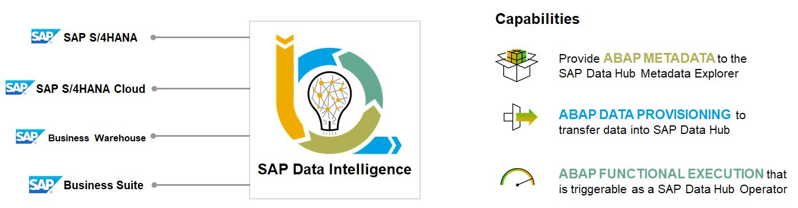
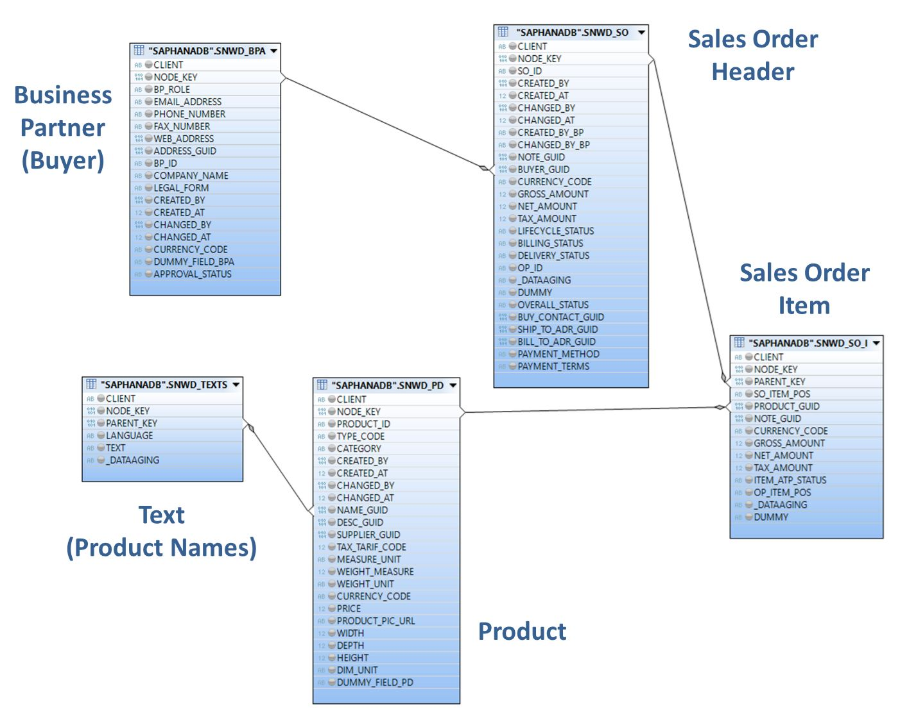
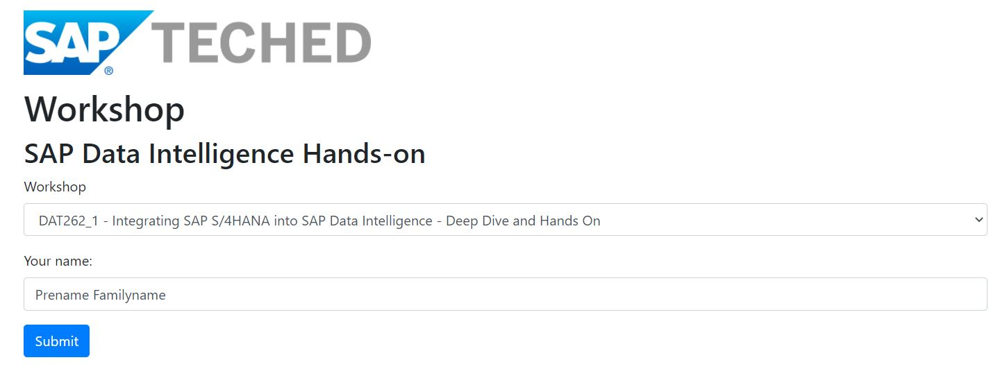

# Overview and Getting Started

The idea of ABAP Integration is to establish a unified model to consolidate all interaction scenarios between SAP Data Intelligence and an ABAP-based SAP system (directional and bi-directional).

The primary use cases for ABAP integration in SAP Data Intelligence are metadata retrieval, data provisioning, and functional execution.

 This Deep Dive and Hands-On Session concentrates on the uses cases of **ABAP Data Provisioning** and **ABAP Functional Execution**. 

**1. ABAP Data Provisioning** 
Getting access to and using real business data in an SAP Data Intelligence pipeline helps you to build new intelligent applications and data flows. 
For example, you may want to obtain the replication data from an SAP S/4HANA system, enrich the data in an SAP Data Intelligence pipeline, and then feed it to a target storage in the cloud. 
The ABAP data provisioning gives you access to SAP S/4HANA and allows you to consume ABAP CDS views directly in a pipeline. ABAP CDS is the semantically rich data model in SAP S/4 HANA and allows the consistent representation of a business object (such as a business partner). It is feasible to just get this data in an initial load, but also to have a stream approach established to consume every update, insert, and delete that happens in the SAP S/4HANA system. For details about what options you have with the different release levels and release combinations, see [SAP Note 2830276](https://launchpad.support.sap.com/#%2Fnotes%2F2830276).

**2. ABAP Functional Execution** 
In certain scenarios, it is required to enhance the scope of a data-driven application by accessing and writing data into an SAP S/4HANA system. For example, it may be necessary to execute a function module or BAPI within a pipeline to read data into SAP Data Intelligence, post information into an ABAP-based SAP system, or trigger an execution in the remote system. If you require this type, you can create your own operator in SAP Data Intelligence that references the corresponding ABAP functionality. You can find a list of all available operators in the ABAP section of the [Repository Object Reference for SAP Data Intelligence](https://help.sap.com/doc/d131eca2150049da86c541ee0895177c/Cloud/en-US/cloud_loiod131eca2150049da86c541ee0895177c.pdf).

## Deep Dive vs. Exercise sections in this document

Other than during the on-site TechEd events in the past years, it was not feasible to provide the Eclipse based ABAP Development Tools (ADT) and the SAP GUI to our participants in the this year's virtual version of the TechEd. But it is a goal of this workshop to show and get the hands on the complete end-to-end implementation processes of ABAP integration with SAP Data Intelligence. 
- For this reason, all parts of this session that require these (local) applications will be presented as ***live Deep Dive demos***, conducted in ADT and in SAP S/4HANA **by the trainer**,
- The ***Exercises*** - in opposite - are then intended to be performed **by the participants** in SAP Data Intelligence and will leverage those objects in S/4HANA that got created during the Deep Dive sections.  

## Short introduction to the Enterprise Procurement Model (EPM) in SAP S/4HANA

In this workshop we will be using the Enterprise Procurement Model (EPM) as a data basis for our Deep Dive and Exercise scenarios. It is provided in all ABAP systems, hence also in SAP S/4HANA, as a ready-to-go demo application. 

The business scenario at the core of EPM is that of a web shop run by a retail company called ITelO, a fictitious company that buys and sells computers & accessories. ITelO is a global player with several subsidiaries and locations world-wide selling its products through direct distribution channels. The company has various reseller and standard customers as well as various suppliers. Customers can purchase goods either directly from ITelO or indirectly from a supplier if the goods are not on stock. 
The main entities supporting the business scenario in EPM are implemented as Business Objects (BO). An example of an EPM BO is the Product BO, which encapsulates the business logic for maintaining and browsing products. The business objects available in EPM support the sales and procurement processes. 

In order to support a realistic scenario, there are means to generate mass data which allow the simulation of real-world data volumes for business entities such as purchase orders and master data such as products. The generated data is approved and can be used at customers’ sites. EPM data can be generated in SAP S/4HANA via transaction **ESPM_DG**.

Even though EPM also provides several BO specific CDS Views, which are all linked to each other via associations, we'll be using the underlying physical tables in our Deep Dive demos and the Exercises. They are starting with the prefix `SNWD_`.

The relevant tables for our scenario are
- BUSINESS PARTNER (`SNWD_BPA`),
- SALES ORDER HEADER (`SNWD_SO`),
- SALES ORDER ITEM (`SNWD_SO_I`),
- PRODUCT (`SNWD_PD`),
- and TEXTS (`SNWD_TEXTS`).

Here is how these tables relate to each other: 
  

## Access to the exercises' Data Intelligence environment

All participants are requested to register for a **individual user name and password** on the workshop specific **SAP Data Intelligence tenant**. 
For so doing, please follow the link to the **[Data Intelligence User Registration Tool](https://register.cfapps.eu10.hana.ondemand.com/)**. 

- In the **Workshop selection list**, choose the hands-on session you are registered for:
     - "**DAT262_1** - Integrating SAP S/4HANA into SAP Data Intelligence - Deep Dive and Hands-On" for the session on **Tuesday, December 8th 2020, from 08:50pm to 10:50pm UTC**
     - "**DAT262_2** - Integrating SAP S/4HANA into SAP Data Intelligence - Deep Dive and Hands-On" for the session on **Wednesday, December 9th 2020, from 08:50am to 10:50am UTC**
- Then enter your name and press submit. Remember the credentials which are being displayed for later usage!
 

>***Important Note***
>The user name registration service for the workshop's Data Intelligence system is available during the following timeslots
>- ***DAT262_1***: On Tuesday, December 8th 2020, from 11:30am UTC to 11:00pm UTC
>- ***DAT262_2***: From Tuesday, December 8th 2020, 02:00pm UTC to Wednesday, December 9th 2020,11:00am UTC
 

After you have successfully obtained your credentials for the SAP Data Intelligence system, you can log on as follows:
- in a Chrome or Firefox Browser, open the link to: **https://vsystem.ingress.dh-6srbrjhsl.dh-canary.shoot.live.k8s-hana.ondemand.com/login/?tenant=dat262**
- the tenant name is ***dat262***. User credential as received from the user registration service described above
- the logon process is also introduced step-by-step in the exercise sections.

The SAP Data Intelligence environment that is assigned to this hands-on workshop already contains a Connection of type RFC to the backend SAP S/4HANA system set up (see also in DI Connection Management). In the Pipelines that you create in SAP Data Intelligence, you can leverage this existing RFC Connection and find and integrate the provided CDS Views and custom ABAP Operators that were implemented during the Deep Dive parts of the workshop.  

## Next Step

After you have now made yourself familiar with
- the structure of the workshop,
- the Enterprise Procurement Model (EPM) as the data basis for our Deep Dive demos and Exercises,
- and your credentials and the approach for accessing SAP Data Intelligence

please continue to **[Deep Dive 1 - ABAP CDS View based data extraction in SAP Data Intelligence](../dd1/README.md)**.
  

*****************************************************

  **Table of Contents / Navigation**

- **[Overview and Getting Started](https://github.com/SAP-samples/teched2020-DAT262/tree/main/exercises/ex0#overview-and-getting-started)**
     - [Deep Dive demos vs. Exercises](https://github.com/SAP-samples/teched2020-DAT262/tree/main/exercises/ex0#deep-dive-vs-exercise-sections-in-this-document)
     - [Short introduction to the Enterprise Procurement Model (EPM) in ABAP systems](https://github.com/SAP-samples/teched2020-DAT262/tree/main/exercises/ex0#short-introduction-to-the-enterprise-procurement-model-epm-in-sap-s4hana)
     - [Access to the exercises' Data Intelligence environment](https://github.com/SAP-samples/teched2020-DAT262/tree/main/exercises/ex0#access-to-the-exercises-data-intelligence-environment)

- **[Deep Dive 1 - ABAP CDS View based data extraction in SAP Data Intelligence](exercises/dd1/)**
    - [Deep Dive 1.1 - Create a simple ABAP CDS View in ABAP Develoment Tools (ADT)](exercises/dd1#deep-dive-11---create-a-simple-abap-cds-view-in-adt)
    - [Deep Dive 1.2 - Delta-enablement for simple ABAP CDS Views](exercises/dd1#deep-dive-12---delta-enablement-for-simple-abap-cds-views)
    - [Deep Dive 1.3 - Create a more complex ABAP CDS View in ADT (joining multiple tables)](exercises/dd1#deep-dive-13---create-a-more-complex-abap-cds-view-in-adt-joining-multiple-tables)
    - [Deep Dive 1.4 - Delta-enablement for complex ABAP CDS Views (joining multiple tables)](exercises/dd1#deep-dive-14---delta-enablement-for-complex-abap-cds-views-joining-multiple-tables)
    - [Deep Dive 1.5 - Integrate ABAP CDS Views in SAP Data Intelligence Pipelines](exercises/dd1#deep-dive-15---integrate-abap-cds-views-in-sap-data-intelligence-pipelines)
    
- **[Deep Dive 2 - Calling an ABAP function module in SAP S/4HANA from SAP Data Intelligence](exercises/dd2/)**
    - [Deep Dive 2.1 - Create a custom ABAP Operator in SAP S/4HANA](exercises/dd2#deep-dive-21---create-a-custom-abap-operator-in-sap-s4hana)
    - [Deep Dive 2.2 - Integrate the custom ABAP Operator in a SAP Data Intelligence Pipeline](exercises/dd2#deep-dive-22---integrate-the-custom-abap-operator-in-a-sap-data-intelligence-pipeline)
    
- **[Exercise 1 - Replicating data from S/4HANA ABAP CDS Views in SAP Data Intelligence](exercises/ex1/)**
    - [Exercise 1.1 - Consume the EPM Business Partner ABAP CDS Views in SAP Data Intelligence](exercises/ex1#exercise-11---consume-the-epm-business-partner-abap-cds-views-in-sap-data-intelligence)
    - [Exercise 1.2 - Extend the Pipeline to transfer Customer data to an S3 Object Store (Initial Load and Delta Load)](exercises/ex1#exercise-12---extend-the-pipeline-to-transfer-the-customer-data-into-an-s3-object-store-with-initial-load-and-delta-load-modes)
    - [Exercise 1.3 - Implement a Pipeline for replication of enhanced EPM Sales Order data to an S3 Object Store](exercises/ex1#exercise-13---implement-a-pipeline-for-delta-transfer-of-enhanced-epm-sales-order-data-from-s4hana-to-an-s3-object-store)
    - [Exercise 1.4 - Extend the Pipeline for joining Sales Order with Customer data for each change in Sales Orders and persist results in S3](exercises/ex1#exercise-14---extend-the-pipeline-for-joining-sales-order-with-customer-data-for-each-change-in-sales-orders-and-persist-results-in-s3)
    
- **[Exercise 2 - Triggering the execution of a function module in a remote S/4HANA system](exercises/ex2/)**
    - [Exercise 2.1 - Making custom ABAP Operators available in SAP Data Intelligence](exercises/ex2#exercise-21---making-custom-abap-operators-available-in-sap-data-intelligence)
    - [Exercise 2.2 - Using a custom ABAP Operator to verify your Delta Replication of EPM Sales Orders](exercises/ex2#exercise-22---using-a-custom-abap-operator-to-verify-your-delta-replication-of-epm-sales-orders)
